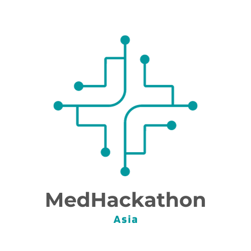
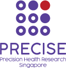
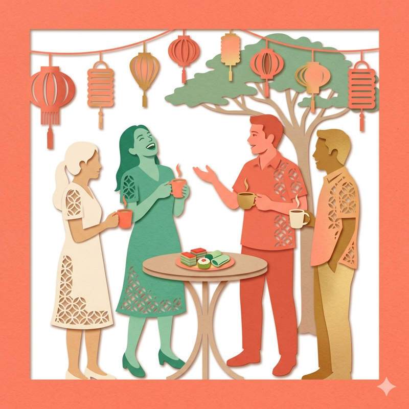

<!-- Hero with logo inside -->

  

  <h1>MedHackathon Asia 2026</h1>
  
Advancing genomic and health data collaboration across Asia

  
July 27 &ndash; 31, 2026 &middot; Singapore

<!-- Supporter — logo at 2x size -->

  
   
  Supported by <a href="https://www.npm.sg/">PRECISE — Precision Health Research, Singapore</a>.

## Overview

MedHackathon Asia is a regional meeting for researchers, clinicians, bioinformaticians, data stewards, and precision medicine leaders working to strengthen genomic and health data collaboration across Asia.

The 2026 edition builds on the discussions and project outcomes documented after [MedHackathon Asia 2025](https://medhackathon.github.io/2025/). The shared objective is to unlock the scientific and clinical value of Asian genomic diversity through practical collaboration on biobanks, data standards, computational workflows, and responsible governance.

## Why this matters

Asia holds the world's largest and most diverse population base, but genomic resources across the region remain fragmented. National initiatives have grown rapidly, yet cross-border collaboration is still limited by differences in metadata standards, access models, privacy regulation, consent practices, and technical infrastructure.

MedHackathon Asia provides a working forum to address these gaps. The aim is not only to discuss policy, but to advance concrete, reusable frameworks for data discovery, secure analysis, and population-aware genomic interpretation.

## MedHackathon Asia 2025

The first edition of MedHackathon Asia was held in February 2025 at Burapha University, Chonburi, Thailand, bringing together researchers from seven jurisdictions — Thailand, Japan, Singapore, Korea, Hong Kong, Indonesia, and India. Participants worked across project tracks including the Asian Pangenome Initiative, genome-phenome archive development, variant analysis harmonization, pharmacogenomics, federated research environments, and data governance. A report summarizing the outcomes is in preparation. See the [MedHackathon Asia 2025 website](https://medhackathon.github.io/2025/) for details.

## 2026 focus areas

The current planning is centered on several themes emerging from the shared report:

- Harmonized biobank collaboration across Asian countries and initiatives
- Standardized metadata, analysis pipelines, and data submission practices
- Responsible data governance, including DAC workflows, privacy protection, and ethical data sharing
- Federated and secure research environments that respect national and institutional requirements
- Reference resources and analytical tools that better represent Asian populations
- Capacity building for precision medicine, including training and shared implementation practices

## Project tracks

The report highlights a set of ongoing and emerging workstreams that inform the 2026 program:

- Asian Pangenome Initiative
- Asian Genome-Phenome Archive data catalogue
- Variant analysis pipeline harmonization
- CNV analysis for clinical interpretation
- HPV DNA detection in PBMC whole-genome sequencing data
- Pharmacogenomics and polygenic risk score implementation for Asian populations
- Federation of Trusted Research Environments
- Ethical, legal, and social issues in genomic data sharing
- Federated aggregated variant browsing across Asian cohorts
- Imputation pipelines and servers for Thai, Japanese, and broader Asian reference panels

## Expected outcomes

MedHackathon Asia 2026 is expected to support:

- Stronger researcher-to-researcher networks across Asian genome and biobank initiatives
- Better alignment on practical standards for genomic and phenotypic data sharing
- Shared understanding of country-specific governance constraints and collaboration models
- Prototype tools, reference resources, and interoperable workflows for regional use
- Clearer roadmaps for federated analysis, trusted research environments, and archive development
- Continued momentum toward equitable precision medicine innovation grounded in Asian populations

## Schedule

**[The full schedule](https://github.com/medhackathon/2026/wiki/Schedule) will be published here.**

July 27&ndash;31, 2026

- **Monday, July 27** — Opening session, community updates and framing talks
- **Tuesday, July 28** — Tutorials, project breakout sessions
- **Wednesday, July 29** — Hackathon working sessions
- **Thursday, July 30** — Hackathon working sessions, cross-team reporting
- **Friday, July 31** — Wrap-up session, next-step planning

## Venue

**D'MARQUEE at Downtown East**
1 Pasir Ris Close, Singapore 519599

The meeting takes place at D'MARQUEE in Downtown East, Pasir Ris, Singapore. The venue is locally hosted by PRECISE (Precision Health Research, Singapore). Attendee check-in is at the venue reception on Monday 27 July from 12:00.

### Getting there

- **MRT + bus (about 40 minutes from Changi Airport):** take the East–West Line to Pasir Ris (EW1), then bus 354 (or 3, 5, 6, 12, 17, 21, 89, or 358 East Loop) to the Downtown East stops.
- **Free Downtown East shuttle** runs between Pasir Ris MRT and the Downtown East Begonia Pick-up Point daily from 11:00 to 22:00, at about 15-minute intervals.
- **Taxi or Grab** from Changi Airport takes about 15 to 20 minutes.

## Accommodation

D'Resort, co-located with D'MARQUEE at Downtown East, is the on-site option. Confirmed participants receive a list of alternative hotels nearby, with indicative travel times, in the registration confirmation email. Participants book their own rooms.

## Who should join

This event is intended for participants working in human genetics, medical informatics, biobanking, clinical genomics, bioinformatics, data governance, and related areas. We welcome researchers and practitioners interested in building shared infrastructure, standards, and collaborative projects for precision medicine in Asia.

## Registration

MedHackathon Asia 2026 is a small working meeting, and venue capacity is limited. Participation is therefore by invitation and review: the organizing committee shares the registration form through country contacts and community channels, and every registration is reviewed before a seat is confirmed.

If you are actively engaged in Asian biobank, genomic, or precision-medicine collaboration and would like to take part, please reach out through the [contacts below](#contact). The registration form will be shared with prospective participants as it opens.

<!-- Contact CTA -->

## Contact

Please join our Google group at [MedHackathon Asia](https://groups.google.com/u/4/g/medhackathon-asia) or email the organizers at [admin-medhackathon-asia@googlegroups.com](mailto:admin-medhackathon-asia@googlegroups.com).

<!-- Closing artwork -->

